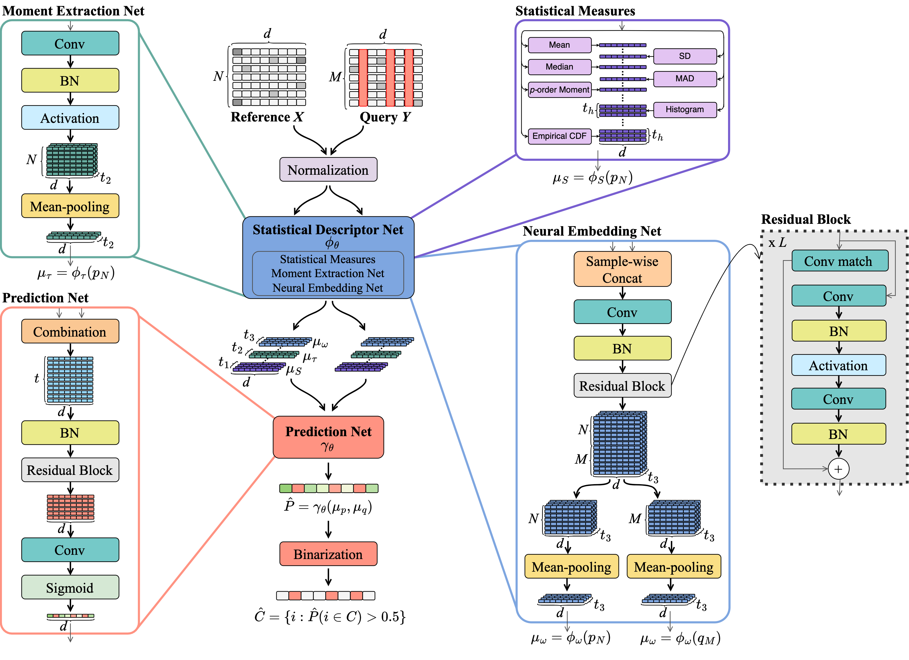

# FSL-Net

[](https://creativecommons.org/licenses/by-nc/4.0/)
[](https://python.org)

**FSL-Net** (Feature Shift Localization Network) detects **feature-level shifts** between a **clean reference** dataset and a **potentially corrupted query** dataset. It compares **statistical descriptors** and **learned functionals** to estimate the **shift probability** for each feature.

FSL-Net is **fast**, **scalable**, and **fully pre-trained** — no fine-tuning required. It is applicable to any reference and query under the assumption that they 

invariant to sample order and approximately equivariant to feature order. It matches or outperforms [DataFix](https://github.com/AI-sandbox/DataFix) in feature shift localization accuracy while offering significantly better time efficiency on large and high-dimensional datasets.

<p align="center">
  
</p>

## Installation

```bash
pip3 install git+https://github.com/AI-sandbox/FSL-Net.git
```

## Model Inputs and Outputs

**Arguments**

```
- `reference` (`torch.Tensor`):  
  Reference batch of shape `(n_samples, n_features)`, `dtype=torch.float32`.  
  Assumed to be clean and serves as the baseline distribution.

- `query` (`torch.Tensor`):  
  Query batch of shape `(n_samples, n_features)`, `dtype=torch.float32`.  
  May contain shifted or corrupted features for comparison against the reference.
```

**Returns**

```
- `y_pred` (`torch.Tensor`):  
  Tensor of shape `(1, n_features)`, `dtype=torch.float32`.  
  Contains predicted probabilities for each feature being distributionally shifted. Values range from `0` to `1`.

- `embeddings` (`list`):  
  A list of intermediate outputs used in the prediction:
  - `ref_neural_embedding` (`torch.Tensor` or `None`): Neural embedding of the reference dataset.
  - `que_neural_embedding` (`torch.Tensor` or `None`): Neural embedding of the query dataset.
  - `y_logits` (`torch.Tensor`): Raw prediction logits before final activation.
```

## Usage

Load the pre-trained FSL-Net model and run inference in just a few lines:

```python
from fslnet.fslnet import FSLNet
import torch
import numpy as np

# Load pretrained FSL-Net model
device = 'cpu'
model = FSLNet.from_pretrained(device=device)

# Load reference and query
ref = torch.tensor(np.load('path_to_ref.npy'), dtype=torch.float32).to(device)
que = torch.tensor(np.load('path_to_query.npy'), dtype=torch.float32).to(device)

# Predict shifted features
with torch.no_grad():
    soft_predictions, _ = model(ref, que)        # Corruption probabilities
    hard_predictions = (soft_predictions > 0.5)  # Boolean mask — True = shifted
```

For a practical example, see [demos/demo.ipynb](./demos/demo.ipynb).

## Citation

If you use FSL-Net in your research, please cite our paper:

> Barrabés, M., Montserrat, D. M., Dev, K., & Ioannidis, A. G. (2025, July). Feature Shift Localization Network. In Forty-second International Conference on Machine Learning (ICML 2025).
